# Cross-Validation Explained

**Prerequisites**: Week 1 guide completed | **Type**: Deep Dive (Optional)

---

## Why a Single Train/Test Split Isn't Enough

When you split your data once into training and test sets, your performance estimate
depends entirely on *which* observations happened to land in each group. One random
split might put all the easy-to-classify cases in the test set, giving you an
optimistic accuracy estimate. Another split might do the opposite.

This should feel familiar. Imagine running a split-half reliability analysis on a
single random half of your calibration sample. You would never trust that one number
on its own --- you know it depends on which items landed in which half. You would want
to repeat the process, or at least correct for the instability (Spearman-Brown).

The same logic applies to evaluating prediction models. A single train/test split
gives you *one* noisy estimate of how well your model generalizes. Cross-validation
gives you a much more stable answer.

---

## What Is K-Fold Cross-Validation?

K-fold cross-validation systematically rotates which portion of the data serves as the
test set, so that every observation gets a turn being evaluated.

Here is the procedure for 10-fold cross-validation:

```mermaid
gantt
    title 10-Fold Cross-Validation
    dateFormat X
    axisFormat %s
    section Fold 1
        TEST :crit, 0, 1
        train : 1, 10
    section Fold 2
        train : 0, 1
        TEST :crit, 1, 2
        train : 2, 10
    section Fold 3
        train : 0, 2
        TEST :crit, 2, 3
        train : 3, 10
    section Fold 4
        train : 0, 3
        TEST :crit, 3, 4
        train : 4, 10
    section Fold 5
        train : 0, 4
        TEST :crit, 4, 5
        train : 5, 10
    section Fold 6
        train : 0, 5
        TEST :crit, 5, 6
        train : 6, 10
    section Fold 7
        train : 0, 6
        TEST :crit, 6, 7
        train : 7, 10
    section Fold 8
        train : 0, 7
        TEST :crit, 7, 8
        train : 8, 10
    section Fold 9
        train : 0, 8
        TEST :crit, 8, 9
        train : 9, 10
    section Fold 10
        train : 0, 9
        TEST :crit, 9, 10
```



*Final estimate = average performance across all 10 folds*

**Step by step:**

1. **Divide** your data into *k* equal-sized parts (called "folds").
2. **For each fold**: hold that fold out as the test set, train the model on the
   remaining *k - 1* folds, and record the performance on the held-out fold.
3. **Average** the performance metrics across all *k* folds.
4. This averaged estimate is far more **stable and trustworthy** than any single split,
   because it does not depend on one lucky or unlucky partition of the data.

Notice that by the end of this process, every single observation in your dataset has
been in the test set exactly once. Nothing is wasted, and no observation is evaluated
by a model that trained on it.

---

## Psychology Analogy

Think of cross-validation as running your psychometric validation on 10 different
random splits of your calibration sample, then reporting the average reliability
coefficient. That averaged number is far more trustworthy than any single split-half
estimate.

If you have used split-half reliability with Spearman-Brown correction, you already
understand the core logic. Spearman-Brown corrects a single split-half estimate to
approximate what you would get with the full test. Cross-validation takes the more
direct route: it actually *runs* multiple splits and averages the results. Same
instinct, applied to prediction models instead of reliability estimates.

---

## Common Choices

- **k = 10** (10-fold CV) is the most widely used default. It provides a good balance
  between bias, variance, and computational cost.
- **k = 5** (5-fold CV) is often used with smaller samples, where each fold needs to
  be large enough to be a meaningful test set.
- **Leave-One-Out (LOO)**: set *k = n*, meaning you train on *n - 1* observations and
  test on the single held-out case, repeated for every observation. This maximizes
  training data per fold but is computationally expensive and can have high variance.
- **Stratified CV**: ensures each fold has roughly the same class proportions as the
  full dataset. This is important when your outcome classes are imbalanced (e.g., 15%
  clinical cases and 85% non-clinical).
- **Repeated CV**: run the entire k-fold procedure multiple times, each time with a
  different random partition into folds, then average across all runs. This produces
  an even more stable estimate.

---

## When to Use What

| Situation | Recommendation |
|---|---|
| Standard ML analysis, n > 200 | 10-fold CV |
| Smaller samples (n = 50-200) | 5-fold CV or repeated 10-fold CV |
| Very small samples (n < 50) | Leave-one-out or repeated 5-fold CV |
| Imbalanced classes | Stratified k-fold CV |
| Reporting for publication | Repeated stratified 10-fold CV |

As a rule of thumb: if you are reporting results in a paper, repeated stratified
k-fold CV gives reviewers the most confidence that your estimate is stable. For quick
exploratory work, a single round of 10-fold CV is perfectly fine.

---

## Cross-Validation in R with tidymodels

The `rsample` package (loaded as part of `tidymodels`) makes cross-validation
straightforward. Here is the key code:

```r
library(tidymodels)

# Step 1: Create 10-fold CV splits, stratified by the outcome variable.
# vfold_cv() divides the data into v folds.
# The strata argument ensures each fold has similar class proportions.
cv_folds <- vfold_cv(train_data, v = 10, strata = clinical_dissatisfaction)

# Step 2: Fit the model on each fold.
# fit_resamples() trains your workflow on k-1 folds, tests on the held-out fold,
# and repeats for all k folds. You specify which metrics to compute.
cv_results <- my_workflow %>%
  fit_resamples(
    resamples = cv_folds,
    metrics = metric_set(accuracy, sensitivity, specificity)
  )

# Step 3: Get averaged metrics across all folds.
# collect_metrics() returns the mean and standard error for each metric.
collect_metrics(cv_results)
```

**What each function does:**

- `vfold_cv()` --- creates the fold structure. It does not fit any models; it just
  records which rows belong to which fold.
- `fit_resamples()` --- runs the full train-and-evaluate cycle on every fold. It takes
  a workflow (your recipe + model specification) and the fold structure.
- `collect_metrics()` --- extracts the averaged performance metrics. The standard error
  column tells you how much the estimate varied across folds.

If you want repeated CV, simply add the `repeats` argument:

```r
cv_folds <- vfold_cv(train_data, v = 10, repeats = 5, strata = clinical_dissatisfaction)
```

This runs 10-fold CV five separate times (50 total fits), giving you an even more
stable estimate.

---

## Cross-Validation vs. Train/Test Split

| | Single Split | Cross-Validation |
|---|---|---|
| Number of performance estimates | 1 | k (averaged) |
| Stability | Low (depends on the split) | High (averaged across splits) |
| Data efficiency | Some data never used for training | All data used for both training and testing |
| Computational cost | Low | k times higher |
| Best for | Quick exploration | Final reported results |

In practice, you often use *both*. A common workflow is:

1. Hold out a final test set at the very beginning.
2. Use cross-validation on the remaining training data to tune your model and select
   among candidate approaches.
3. Once you have settled on a final model, evaluate it one last time on the held-out
   test set. That single number is your honest, unbiased performance estimate.

---

## Common Mistakes

**Testing on training data.** If you evaluate your model on the same data it was
trained on, you are not doing cross-validation --- you are just reporting training
accuracy. This will always look good and tells you nothing about generalization.

**Reporting CV results as final performance after using CV to select the model.** If
you used cross-validation to choose between, say, logistic regression and random
forest, those CV numbers are now optimistically biased for the winning model. You need
a separate held-out test set for the final, unbiased estimate.

**Not stratifying when classes are imbalanced.** If only 10% of your sample has the
outcome of interest, a random fold could end up with 0% or 20% by chance. Stratified
CV prevents this.

**Doing feature selection before CV (data leakage).** If you look at the full dataset
to decide which variables to include, and *then* run cross-validation, the test folds
are not truly held out --- they influenced your feature choices. Feature selection must
happen *inside* each fold, as part of the training step. In tidymodels, putting your
feature selection in the recipe handles this correctly.

---

## The Key Takeaway

Cross-validation gives you a more honest, more stable estimate of how your model will
perform on new data. It is not a different kind of model --- it is a better way to
*evaluate* any model. Whenever you report prediction performance, especially in a
publication, cross-validation (or one of its variants) should be your default approach.

---

## Want to Practice?

For a hands-on walkthrough where you implement cross-validation from scratch and
compare it to a single train/test split, see
[deep-dives/cross-validation-in-practice.Rmd](cross-validation-in-practice.Rmd).
