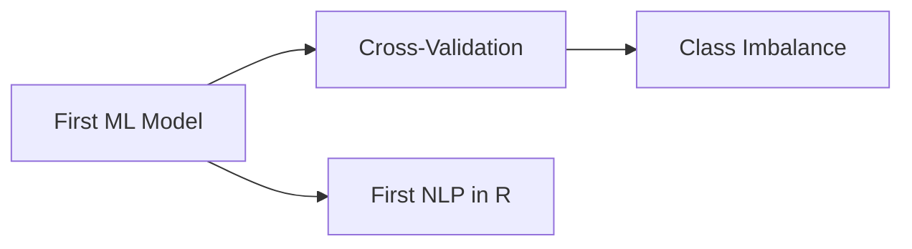

# R Notebooks

**Optional extensions. The core course requires no coding.**

These R Markdown notebooks provide hands-on machine learning experience in R. They are designed for psychology researchers who already use R for statistics and want to extend their skills into ML territory.

---

## Before You Start

### Install R Packages

Open RStudio and run:

```r
# Core packages (for First ML Model and Cross-Validation notebooks)
install.packages("tidymodels")
install.packages("tidyverse")
install.packages("vip")
install.packages("ranger")

# For the NLP notebook
install.packages("quanteda")
install.packages("quanteda.textstats")
install.packages("quanteda.textplots")

# For the Class Imbalance notebook
install.packages("themis")

# Optional (for bonus exercises with real data)
install.packages("psych")
```

This may take several minutes if it's your first time installing tidymodels.

---

## Available Notebooks

### 1. Your First ML Model

**File**: `week-2-r-notebook.Rmd`
**Prerequisites**: Week 1 guide, R/RStudio

Build your first machine learning model using tidymodels. You'll simulate a body dissatisfaction dataset, split it into training and test sets, fit a logistic regression, swap in a random forest, compare their performance, and interpret variable importance. The notebook is fully pre-built — open it and run it chunk by chunk.

**What you'll learn**: The tidymodels workflow (recipe → model → workflow → fit → evaluate), train/test split in practice, confusion matrices, and why random forests are often better than logistic regression for complex data.

---

### 2. Cross-Validation in Practice

**File**: `cross-validation-in-practice.Rmd`
**Prerequisites**: First ML Model notebook

Apply v-fold cross-validation to the body dissatisfaction dataset and compare results to your single train/test split from the first notebook. See how cross-validation produces more stable, reliable performance estimates.

---

### 3. Handling Class Imbalance

**File**: `class-imbalance.Rmd`
**Prerequisites**: First ML Model notebook

Why accuracy misleads with rare outcomes (the 95% accuracy trap from Week 2), and how to fix it with upsampling and downsampling techniques. You'll see firsthand how class imbalance affects model performance and learn practical solutions using the `themis` package.

---

### 4. First NLP in R

**File**: `first-nlp-in-r.Rmd`
**Prerequisites**: Week 1 guide, R/RStudio

Text analysis with the `quanteda` package. You'll create a corpus, tokenize text, analyze word frequencies, and run keyword-in-context searches. This notebook introduces the basics of working with text data in R — a foundation for more advanced NLP work.

---

## Suggested Order



Start with **First ML Model** — it introduces the tidymodels framework that the next two notebooks build on. **First NLP in R** can be done at any point since it uses a different package (quanteda).

---

## How to Use These Notebooks

1. Open the `.Rmd` file in RStudio
2. Run code chunks one at a time (click the green play button or press Ctrl+Shift+Enter / Cmd+Shift+Enter)
3. Read the commentary between chunks — that's where the learning happens
4. Experiment after completing each notebook — try changing variables, swapping algorithms, or using your own data

> **These notebooks are supplementary.** The core course assumes you have NOT completed them. If someone asks about your AI/ML experience, the hands-on activities from the weekly explorations (qualitative coding comparison, NLP classification, accuracy analysis) are your primary talking points. The R notebooks add depth for those who want it.
