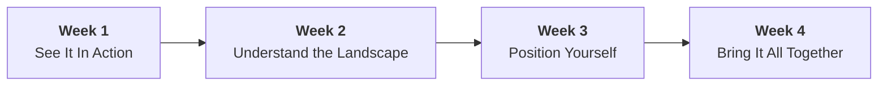
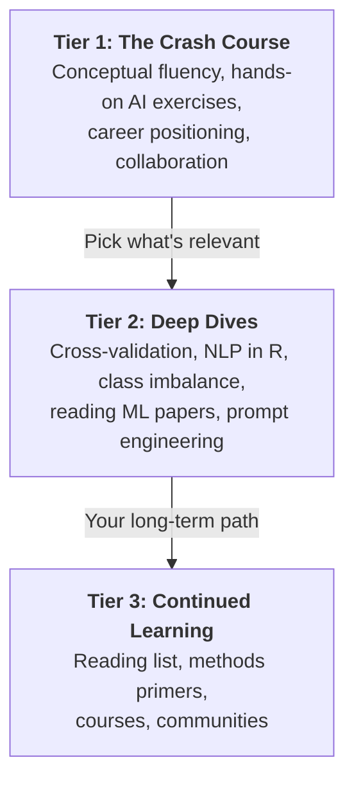

# AI/ML Crash Course for Psychology Researchers

**No coding required. No R. No Python. Just ChatGPT, Claude, and your existing expertise.**

A self-paced guide for conceptual fluency and career positioning — not deep technical mastery. Each section is designed to be completed in short sittings, on your schedule.

---

## Who This Is For

You're a psychology PhD (clinical, developmental, or related field) who:

- Has strong research skills and statistical training
- Sees job postings mentioning "AI/ML" and wants to know what that means for you
- Wants to speak intelligently about AI/ML in interviews, research statements, and grant applications
- Does NOT need to become a data scientist — you need to become a psychologist who can bridge to computational methods

!!! tip "Adapting This Course"
    This course uses body image, mother-daughter communication, and adolescent development as running examples — but the framework applies to any psychology research area. Wherever you see a specific example, substitute your own research topic, population, and data type. The strategic logic is the same.

---

## What You'll Walk Away With

- **Firsthand experience with AI-assisted qualitative coding and text classification** — you'll compare your manual coding with ChatGPT's and classify social media posts alongside an AI model
- **A 1-page research note** connecting AI/ML to your work, drafted and refined with AI assistance
- **Draft career materials** — research statement language, cover letter paragraphs, and interview talking points that incorporate AI/ML vision
- **Interview-ready confidence** — practiced answers to common AI/ML questions, a polished elevator pitch, and clear calibration of what you can claim
- **Conceptual fluency with 25+ AI/ML terms** grounded in psychology analogies you already understand

---

## What You Need

### Required

- **ChatGPT or Claude account** (free tier is fine) — used for all explorations and the AI tutor prompt

### Optional (for Deep Dives)

- **RStudio with R installed** — only needed if you choose the optional R notebook deep dives
- R packages: `tidymodels`, `tidyverse`, `vip`, `ranger`, `quanteda`, `themis`

### Also Recommended

- A paper or abstract from your own research (used in Week 1 Exploration 3)
- Access to the papers referenced in the [Reading List](supplementary/reading-list.md)

---

## Course Map

**[Week 1 — See It In Action](week-1/index.md)** starts with doing, not reading. You compare manual qualitative coding with AI coding, walk through a real ML paper, and brainstorm AI extensions for your research — then debrief the vocabulary that showed up.

**[Week 2 — Understand the Landscape](week-2/index.md)** maps real applications in NLP, predictive modeling, digital phenotyping, and AI-assisted intervention. You classify social media posts alongside an AI model and discover why 99% accuracy can be worse than 74%.

**[Week 3 — Position Yourself](week-3/index.md)** is career strategy. You draft a 1-page research note, build research statement language, brainstorm fundable grant angles, and prepare for interview questions.

**[Week 4 — Bring It All Together](week-4/index.md)** is interview preparation. You practice answering the most common AI/ML interview questions, build your elevator pitch, and calibrate exactly what you can and can't claim.

---

## Three-Tier Structure

This course uses a **three-tier structure**. Everyone completes Tier 1. Tiers 2 and 3 are optional extensions.

---

## Your AI Tutor

Before you start the course, do this:

> **Go to the [AI Tutor](ai-tutor.md) page, copy the prompt, and paste it into ChatGPT or Claude.** This gives you a personalized AI tutor that knows your background, your research areas, and where you are in the curriculum. Use it whenever you're confused, want to explore a concept further, or need a psychology-specific example.

The tutor page includes a one-click-copy prompt, a walkthrough of why each section works (with connections to prompt engineering principles), and instructions for customizing it to your own research area.

---

## How to Use This Course

=== "Just the essentials"

    **Core only — no deep dives.** Work through each week's guide and explorations. Skip activities marked "If you have more time." Every activity is designed to be short enough to do in a single sitting.

    - Week 1: Guide + Explorations 1-2
    - Week 2: Guide + Explorations 1-2
    - Week 3: Guide + Exploration 1
    - Week 4: Guide + Explorations 1-2

=== "The full experience"

    **Core + selected deep dives.** Complete all weekly content including optional explorations, plus deep dives that interest you.

    - Week 1: All explorations + Glossary review
    - Week 2: All explorations + Cross-Validation Explained deep dive
    - Week 3: All explorations + Templates + Reading ML Papers deep dive
    - Week 4: All explorations + Interview Prep Guide + Honesty Calibration

---

## A Note on Tone

This course was designed for you — not for a computer science audience. Every concept is explained through psychology analogies. The goal is empowerment, not overwhelm. You are not starting from zero: your research skills, statistical training, and domain expertise are genuinely valuable in the AI/ML space.

Every activity is bite-sized and self-contained — something you can do in a coffee break or between meetings, not a second job. There are no deadlines. Move at whatever pace works for your life.

This course won't make you an AI/ML expert. But it will make you a psychologist who can speak the language, see the opportunities, position yourself credibly on the job market, and start a real collaboration. That's a significant competitive advantage.
