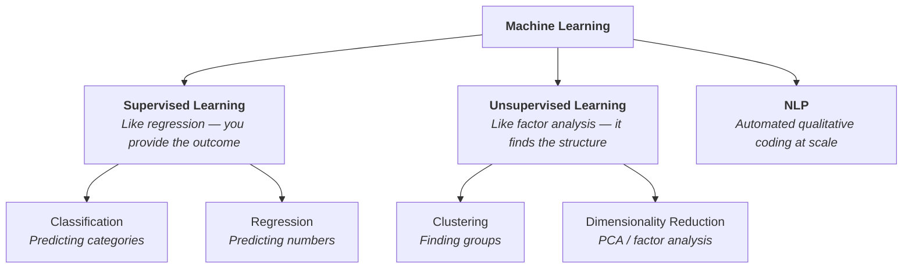

# Week 1: See It In Action

**By the end of this week, you will be able to:**

- Explain the relationship between AI, machine learning, and deep learning
- Describe the major types of machine learning and connect each to a psychology method you already know
- Articulate how AI/ML is being used in psychology research right now
- Identify specific connections between AI/ML and your own research
- Use core AI/ML terminology accurately and confidently

---

## Start Here

!!! example "Start Here: Exploration 1 — Qualitative Coding Face-Off"
    Before reading any further, go to **[Exploration 1](explorations.md#exploration-1-qualitative-coding-face-off)** and do the qualitative coding comparison activity. You'll code an interview excerpt manually, then have ChatGPT code the same excerpt, and compare results. Come back here when you're done.

---

## What You Just Did

Welcome back. You just experienced one of the most discussed applications of AI in psychology research: **automated qualitative coding using a large language model**.

Let's name the concepts that showed up in that activity:

- **Natural Language Processing (NLP)**: The branch of AI that lets computers understand human language. When ChatGPT coded Mia's interview, it was performing NLP — specifically, text classification.
- **Large Language Model (LLM)**: ChatGPT and Claude are LLMs — AI systems trained on massive text datasets that can understand and generate language. You just used one as a research tool.
- **Zero-shot classification**: You didn't give ChatGPT any training examples. You just described what you wanted and it performed the task. This is "zero-shot" — the model generalizes from its pretraining without specific examples from your data.
- **Human-in-the-loop**: The approach you just practiced — AI codes, human reviews and corrects — is the gold standard for using AI in research. Your expertise didn't become less important; it became more efficient.

> **Key Takeaway**: NLP-based coding is not a replacement for your qualitative expertise — it's a collaborator. The AI is fast and consistent but lacks your theoretical depth. The most powerful approach combines both.

---

## Activity 2: Guided Paper Reading

!!! example "Exploration 2 — Walk Through an ML Paper"
    Now go to **[Exploration 2](explorations.md#exploration-2-guided-paper-reading)** and work through the guided paper reading activity. You'll walk through Rothenberg et al. (2023) — a real ML study predicting adolescent mental health from 79 variables. All the information you need is provided inline.

---

## The Vocabulary That Just Showed Up

Between the coding exercise and the paper reading, you encountered a dozen AI/ML concepts without a single lecture. Let's organize them.

### The Buzzword Landscape

You'll encounter a lot of terms that sound intimidating but often describe things you already understand:

| Buzzword | What It Actually Means |
|----------|----------------------|
| Algorithm | A statistical procedure (like "run a regression" is an algorithm) |
| Model | The output of running an algorithm on data (like a fitted regression equation) |
| Training | Running the algorithm on data so it learns the patterns |
| Features | Your predictor variables / IVs |
| Labels | Your outcome variable / DV |
| Pipeline | A sequence of data processing steps (like: clean data → create variables → run model → evaluate) |
| NLP | Teaching computers to understand human language — automated qualitative coding at scale |

### Types of Machine Learning

| Type | What It Does | Psychology Equivalent |
|------|-------------|---------------------|
| **Supervised Learning** | Learns from labeled examples (input + correct answer) | Regression, logistic regression |
| **Unsupervised Learning** | Finds hidden patterns without labels | Factor analysis, cluster analysis |
| **Classification** | Predicts categories (yes/no, Group A/B/C) | Logistic regression |
| **Regression (ML)** | Predicts continuous numbers | Linear regression |
| **Clustering** | Groups similar data points | Cluster analysis |

### Evaluation Concepts

| Term | What It Means | Psychology Equivalent |
|------|--------------|---------------------|
| **Training set** | Data the model learns from | Development sample |
| **Test set** | Held-out data for evaluation | Holdout sample for cross-validation |
| **Overfitting** | Model memorizes noise, fails on new data | Capitalizing on chance |
| **Cross-validation** | Testing on multiple subsets for robust evaluation | Same term — you already know this |
| **Accuracy** | Percentage of correct predictions | Hit rate |
| **Precision / Recall** | PPV and sensitivity | The false-positive / false-negative tradeoff |

For full definitions with psychology analogies and examples, see the [Terminology Glossary](glossary.md).

---

## The ML Family Tree

Machine learning has several major branches. The good news: each one maps to something you already know.

??? note "Supervised Learning — Details"
    **What it is**: You give the model both input data (features) and the correct answers (labels). The model learns the mapping.

    **Psychology translation**: This is every regression and classification analysis you've ever run. You have predictors, you have an outcome, and you're modeling the relationship.

    **Common algorithms**:

    - **Logistic Regression** — You already know this one. In ML, it's a baseline.
    - **Random Forest** — Hundreds of decision trees, each trained on random subsets of data, voting on the answer. Like asking 500 clinicians who each see different subsets of patient information to independently predict the outcome.
    - **Gradient Boosting** — Builds models sequentially, each correcting the mistakes of the previous one. Like iterative peer review.
    - **LASSO** — Linear regression with a penalty that forces some coefficients to zero, performing automatic variable selection. This is what Rothenberg et al. used.

??? note "Unsupervised Learning — Details"
    **What it is**: You give the model only input data — no labels. It discovers hidden patterns.

    **Psychology translation**: This is exploratory factor analysis and cluster analysis.

    **Key types**:

    - **Clustering**: Groups similar data points. K-means clustering in ML is the same k-means from SPSS. Example: clustering mother-daughter dyads based on communication patterns to discover naturally occurring "relationship types."
    - **Dimensionality Reduction**: Reduces many variables to fewer dimensions. PCA in ML IS the same PCA from psychometrics. Example: reducing 50 social media behavior variables to a handful of meaningful dimensions.

??? note "Natural Language Processing (NLP) — Details"
    **What it is**: AI for understanding human language. Draws on both supervised and unsupervised techniques.

    **Key techniques**:

    - **Sentiment Analysis**: Detecting emotional tone in text. Like having an RA code valence, but at scale.
    - **Topic Modeling**: Discovering themes across documents. Like computational thematic analysis.
    - **Text Classification**: Assigning categories to text. What you just did with the Mia interview.

    **Example in your research**: Using NLP to analyze how mothers and daughters discuss bodies in conversation transcripts — identifying patterns in language that predict body dissatisfaction outcomes.

??? note "Neural Networks and Deep Learning — High Level"
    **What it is**: Layers of mathematical transformations that can learn almost any pattern. When these networks have many layers, it's called "deep learning." ChatGPT is built on deep learning.

    **Key things to know**:

    - They excel at image recognition, language understanding, and text generation
    - The tradeoff: very powerful but hard to interpret (the "black box" concern)
    - **Explainable AI (XAI)** addresses this with methods like SHAP values that reveal what drove a prediction
    - For your purposes: you're more likely to *use* deep learning tools (like ChatGPT) than to *build* them

---

## Where YOUR Research Meets AI/ML

This is the most important section of the week. **How does AI/ML specifically connect to your work?**

### Body Image Research + AI/ML

- **NLP for body talk**: Analyze social media discourse about bodies at scale. Your theoretical knowledge of body image constructs makes you the ideal person to design and interpret these analyses
- **Automated coding**: Instead of manually coding posts as "thin-ideal promoting" or "body-positive," NLP models can learn to classify content — but they need someone who understands the constructs
- **Predictive modeling**: Combine many variables (parental influence, peer influence, media exposure, temperament) into a single risk prediction model for body dissatisfaction

### Mother-Daughter Relationships + AI/ML

- **NLP for dyadic communication**: Process transcript data from mother-daughter interactions, coding for themes and linguistic patterns at a scale impossible by hand
- **Communication pattern detection**: ML can identify patterns in dyadic communication — escalation sequences, topic avoidance, reassurance-seeking — across many dyads simultaneously
- **Linking language to outcomes**: Combine NLP analysis of conversations with longitudinal body image data to test whether specific linguistic features predict adolescent body dissatisfaction

### Adolescent Development + AI/ML

- **Digital phenotyping**: Track smartphone use patterns to identify behavioral signatures associated with body image fluctuations
- **EMA + ML**: Combine momentary assessments with ML models to detect within-person triggers in real time
- **Developmental prediction**: ML models can incorporate complex, nonlinear effects of development on body image outcomes

> **Key Takeaway**: You don't need to become a data scientist. You need to be the person who knows which questions matter, which variables are psychologically meaningful, which interpretations make sense, and which ethical considerations are critical. AI/ML provides the tools; your psychology expertise provides the direction.

---

## Self-Check

Before moving on, make sure you can answer these conversationally:

**1.** A colleague asks "What's the difference between AI and machine learning?" Explain it to them using the nested-circles analogy.

??? check "Hint"
    AI is the broadest circle (any intelligent computer system), ML is a subset (systems that learn from data), deep learning is a subset of ML (multi-layered neural networks). When psychologists say "AI/ML" they usually mean machine learning.

**2.** You're reading a paper that uses "supervised learning." Without looking it up, explain what that means — and name a psychology method that works the same way.

??? check "Hint"
    Supervised = you provide the outcome and the model learns the mapping (like regression or logistic regression). Unsupervised = model finds structure on its own (like factor analysis or cluster analysis).

**3.** Someone at a conference mentions NLP. You have 30 seconds — why should a psychology researcher care?

??? check "Hint"
    Psychology generates enormous amounts of text data — therapy transcripts, open-ended survey responses, social media posts. NLP scales qualitative analysis without replacing your interpretive expertise. It's the bridge between what you already do and computational scale.

**4.** Pick one area of your research. Describe one specific way AI/ML could extend it — be concrete, not vague.

??? check "Hint"
    The strongest answers connect a specific ML method to a specific research question, not just "I could use AI for my research."

**5.** Explain overfitting to a psychology grad student using an analogy they'd understand.

??? check "Hint"
    Overfitting = model memorizes noise and won't generalize. Like getting a great R² by throwing in too many predictors relative to your sample size — it looks great on your data but won't replicate. Solution: evaluate on held-out data the model never saw during training.

> **Answer sketches**: See [Self-Check Answer Keys](../deep-dives/self-check-answer-keys.md) after attempting on your own.

---

## What's Next

In **Week 2**, you'll shift from "see it in action" to "understand the landscape." You'll:

- Classify social media posts alongside an AI model
- Discover why 99% accuracy can be worse than 74%
- Map the five major areas where AI/ML is transforming psychology research
- Grapple with the ethics of AI/ML in youth populations

You've seen it work. Now you'll understand where it's heading.

Move on to **[Week 2: Understand the Landscape](../week-2/index.md)** when you're ready.
